# Accessa

**Accessa** is an iOS application designed for browsing discounts and promotional offers from partner organizations.

The app allows users to:

- Explore featured and pinned offers  
- Search and filter offers by category and organization  
- Browse and filter offers on the map  
- View detailed offer pages  
- Browse partner organizations and their details  
- Manage account and profile information  

Users can explore offers without an account to preview available discounts.  
To redeem and use discounts, the user must have an **active account**.

---
## Screenshots
<p>
  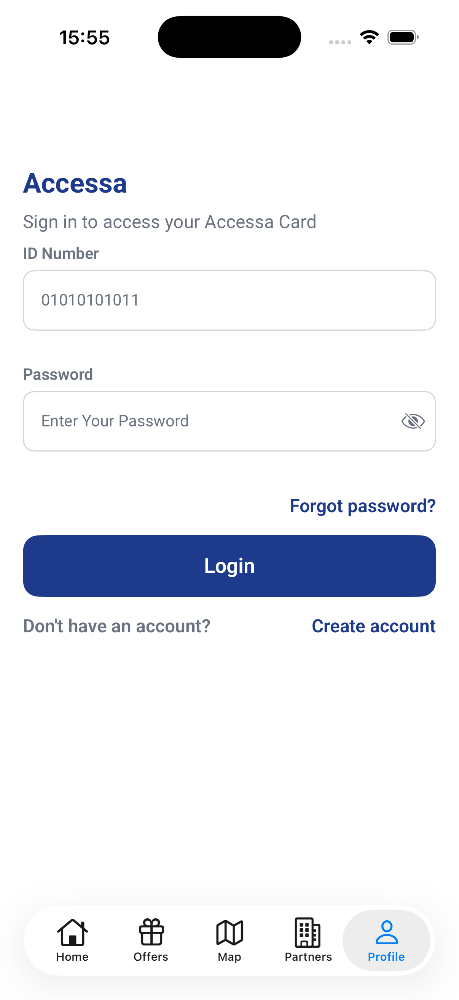
  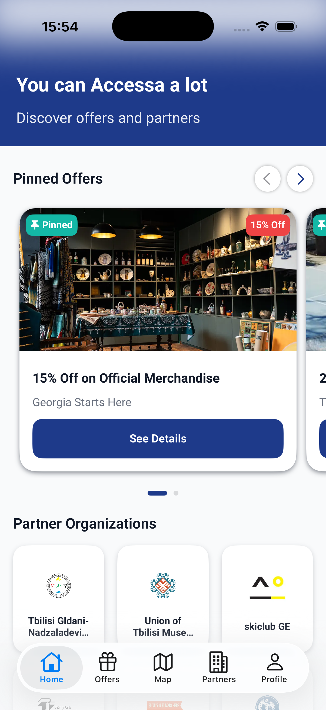
  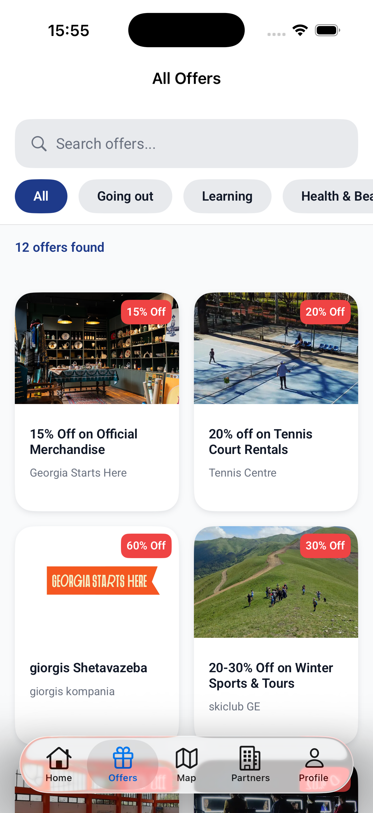
  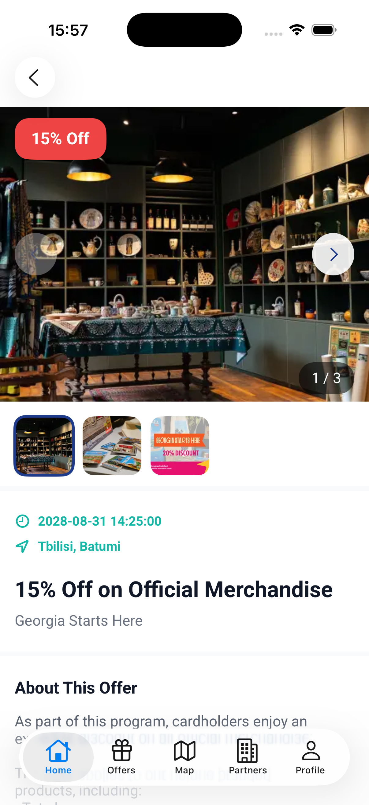
  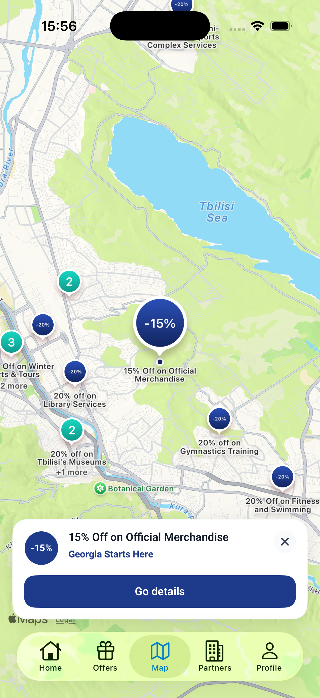
  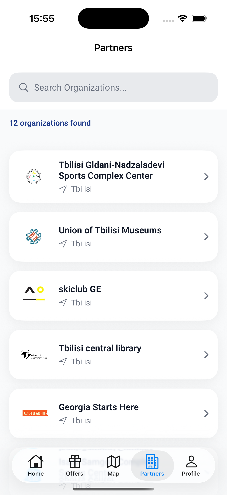
  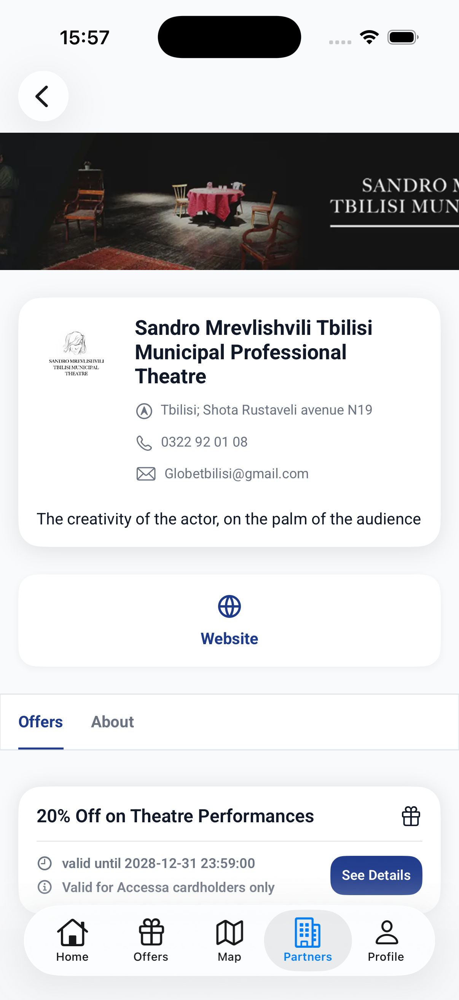
  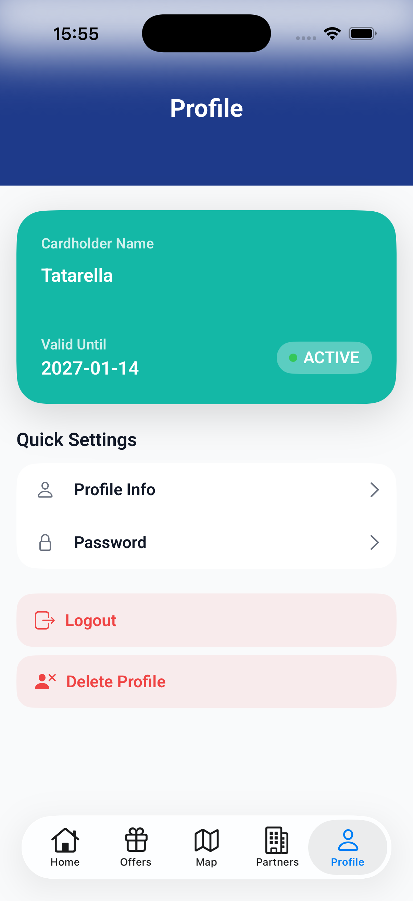
</p>

---

## Tech Stack

- **Language:** Swift
- **UI:** UIKit + SwiftUI
- **Navigation:** Coordinator pattern
- **Networking:** Async/Await + URLSession
- **Auth:** Bearer token stored in **Keychain**
- **Dependency Management:** Swift Package Manager (SPM)
- **Libraries:**
  - **Kingfisher** (image loading & caching)
  - **IQKeyboardManager** (+ related packages)

---

## Architecture

This project follows:

- **Coordinator pattern** for navigation and flow control
- **SwiftUI Views** embedded in **UIKit navigation** via `UIHostingController`
- A custom **DI container** for construction of services + view models
- A centralized **NetworkService** with strongly-typed endpoints
  
--- 

## App Entry & Flow
---

### Architecture Diagrams

| High-Level Flow | DI + Services + Network Flow | Unauthorized (401) Flow |
|---|---|---|
| 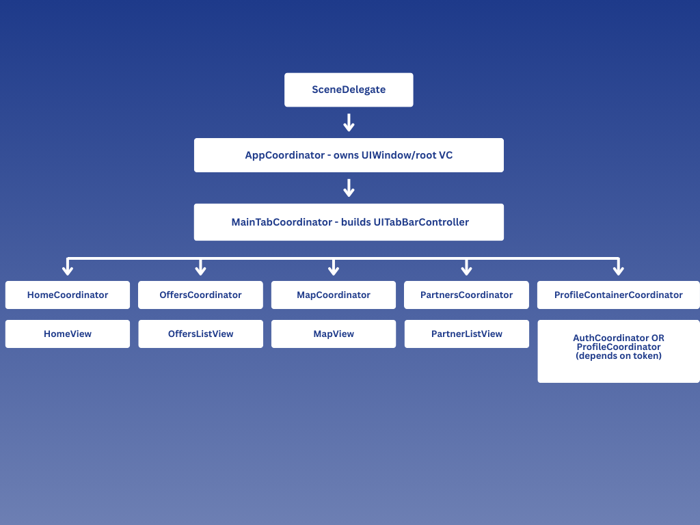 | 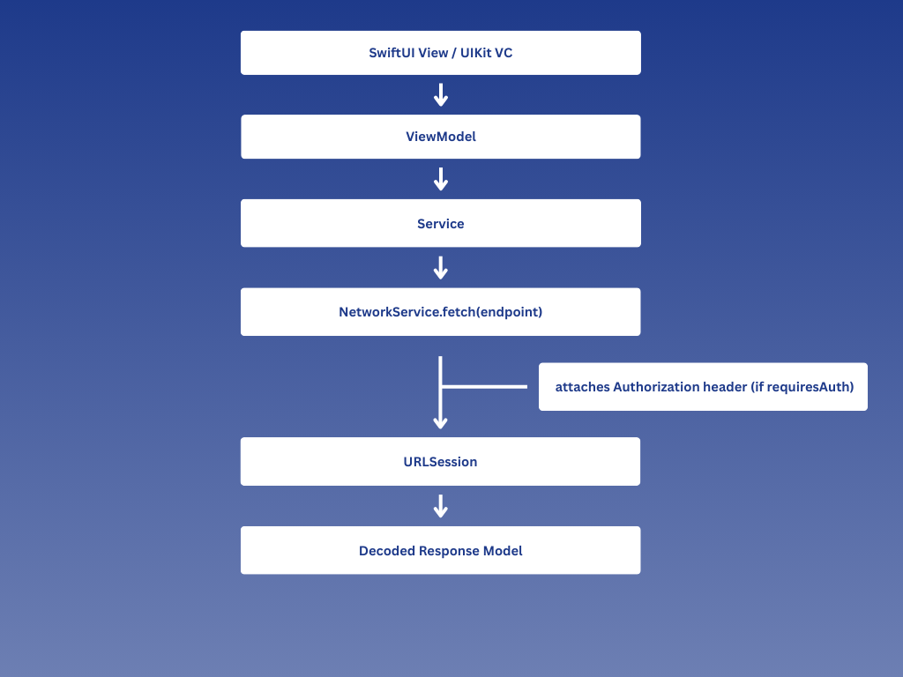 | 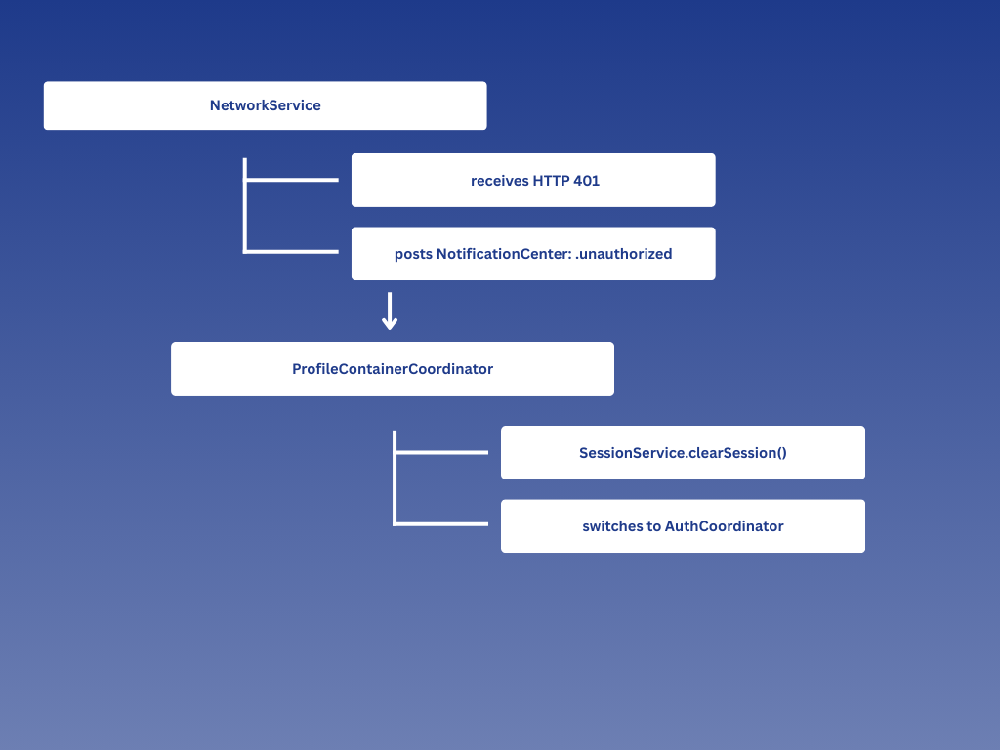 |


---

### App Launch
The app starts from `SceneDelegate` and initializes the root coordinator:

- `SceneDelegate` → `AppCoordinator(window:container:)` → `start()`

### Main UI (Tab Bar)
`MainTabCoordinator` builds a `UITabBarController` and sets up **5 tabs**, each managed by its own coordinator:

1. **Home** → `HomeCoordinator`
2. **Offers** → `OffersCoordinator`
3. **Map** → `MapCoordinator`
4. **Partners** → `PartnersCoordinator`
5. **Profile** → `ProfileContainerCoordinator`

---

## Coordinators & Routing

### Coordinators

- `AppCoordinator` *(root entry point)*
- `MainTabCoordinator` *(tab bar composition)*
- `HomeCoordinator`
- `OffersCoordinator`
- `MapCoordinator`
- `PartnersCoordinator`
- `ProfileCoordinator`
- `ProfileContainerCoordinator` *(decides Profile vs Auth inside Profile tab)*
- `AuthCoordinator` *(Login / Register / Forgot)*

### Routing Protocols
Routing is done through protocols to avoid coupling SwiftUI screens to UIKit navigation logic.

Example:
- `OfferRouting` (`openOffer(id:)`) is implemented by coordinators so SwiftUI screens can request navigation without handling `pushViewController`.

---

## Dependency Injection (DI)

The project uses a custom DI container:

- `DependencyContainer`
  - supports `register` and `resolve`

### AppContainer Registrations

#### Services
- `SessionService`
- `ValidationService`
- `AuthService`
- `ProfileService`
- `HomeService`
- `OffersService`
- `OfferDetailService`
- `PartnerService`
- `PartnerDetailService`

#### ViewModels
- `LoginViewModel`
- `RegisterViewModel`
- `ForgotPasswordViewModel`
- `ProfileViewModel`
- `EditProfileViewModel`
- `ChangePasswordViewModel`
- `HomeViewModel`
- `OffersListViewModel`
- `PartnerListViewModel`
- `MapViewModel`

#### Factories (ViewModels with runtime parameters)
- `makeOfferDetailViewModel(id:)`
- `makePartnerDetailViewModel(organizationPageId:organizationItemId:)`

---

## Networking & Session

### Network Layer
All API calls go through:

- `NetworkService.fetch(from:) async throws -> T`

Endpoints are modeled with an `Endpoint` abstraction:

- `path`
- `method`
- `headers`
- `parameters`
- `hasQueryParameters`
- `requiresAuth`

### Auth Header Injection
If an endpoint requires authentication and a token exists, the request includes:

```
Authorization: Bearer <token>
```

### Keychain Token Storage
`SessionService` stores the auth token in **Keychain** under:

- `auth_token`

### Unauthorized (401) Handling
When `NetworkService` receives **401 Unauthorized**, it posts:

- `.unauthorized` notification via `NotificationCenter`

`ProfileContainerCoordinator` observes this notification and:

- clears the session (`SessionService.clearSession()`)
- switches back to Auth flow inside Profile tab

---

## Configuration (BASE_URL)

 Base URL is read from Info.plist:

- `AppConfig.baseURL` expects `BASE_URL`

`Info.plist` contains:

- `BASE_URL = $(BASE_URL)` *(build setting substitution)*

And the actual value is defined in:

- `Config/App.xcconfig`

If the app crashes with:

`fatalError("BASE_URL is missing or invalid.")`

then verify that `BASE_URL` is correct in `App.xcconfig`.

---

## Project Structure

```
Accessa/
├── Accessa.xcodeproj/
├── README.md
└── Accessa/
    ├── App/
    │   ├── AppConfig.swift
    │   ├── AppCoordinator.swift
    │   ├── AppDelegate.swift
    │   ├── SceneDelegate.swift
    │   └── DI/
    │       ├── AppContainer.swift
    │       └── DependencyContainer.swift
    │
    ├── Config/
    │   └── App.xcconfig
    │
    ├── Coordinator/
    │   ├── Coordinator.swift
    │   ├── MainTabCoordinator.swift
    │   ├── AuthCoordinator.swift
    │   ├── HomeCoordinator.swift
    │   ├── OffersCoordinator.swift
    │   ├── MapCoordinator.swift
    │   ├── PartnersCoordinator.swift
    │   ├── ProfileCoordinator.swift
    │   └── ProfileContainerCoordinator.swift
    │
    ├── Features/
    │   ├── Auth/
    │   │   ├── LogIn/
    │   │   ├── Register/
    │   │   └── ForgotPassword/
    │   └── Pages/
    │       ├── Home/
    │       ├── Offers/
    │       ├── Partners/
    │       ├── Map/
    │       └── Profile/
    │
    ├── Services/
    │   ├── NetworkService/
    │   │   └── API/
    │   │       ├── AuthAPI.swift
    │   │       ├── ProfileAPI.swift
    │   │       ├── DiscountsAPI.swift
    │   │       ├── OrganizationsAPI.swift
    │   │       ├── CategoriesAPI.swift
    │   │       ├── CardAPI.swift
    │   │       └── MediaAPI.swift
    │   ├── PageServices/
    │   ├── SessionService/
    │   └── Validation/
    │
    ├── Shared/
    │   ├── Components/
    │   ├── Extensions/
    │   ├── Models/
    │   └── Typography/
    │
    └── Resources/
        ├── Info.plist
        ├── Assets.xcassets/
        ├── Fonts/
        └── mapOffers.json
```

---

## Requirements

- **Xcode:** 15+
- **iOS Deployment Target:** 17.6+
- **Swift:** 6.0

---
